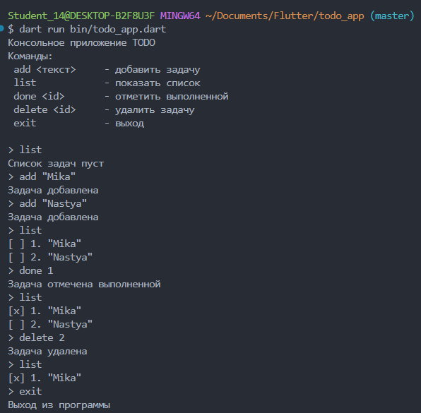

# Лабораторная работа №1. Быстрое погружение в язык Dart. Создание консольное приложение ToDo.
Простое консольное приложение для управления списком задач (Todo), написанное на языке Dart. Проект создан для изучения основ Dart: null safety, коллекции, асинхронность, работа с пакетами и система контроля версий Git.

## Информация об авторе
- **Имя:** Зламанюк А.А.
- **Группа:** ИСП-231

## Скриншот приложения


## Как запустить проект
1. **Клонируйте репозиторий:**
   ```bash
   git clone https://github.com/[Ваш_Username]/Flutter_Lab1.git
   cd Flutter_Lab1/todo_app
   ```
2. **Установите зависимости (опционально, если используется пакет ansicolor):**
   ```bash
   dart pub get
   ```
3. **Запустите приложение:**
   ```bash
   dart run bin/todo_app.dart
   ```
4. **Используйте команды:**
   - `add <текст>` — добавить задачу
   - `list` — показать все задачи
   - `done <id>` — отметить задачу выполненной
   - `delete <id>` — удалить задачу
   - `exit` — выйти из программы

## Что изучили?
1. **Основы Dart:** синтаксис, точка входа `void main()`, `print`, типы данных.
2. **Null Safety:** разница между `String` (non-nullable) и `String?` (nullable).
3. **Модификаторы `final` и `const`:** неизменяемые переменные, время определения значения (runtime vs compile-time).
4. **Коллекции и функции:** `List`, `Map`, named parameters, стрелочные функции.
5. **Асинхронность:** понятие `Future`, использование `async/await` для неблокирующих операций (ввод/вывод, задержки).

## Ответы на вопросы:
### 1. Чем `final` отличается от `const` в Dart?
|`final`|`const`|
|---|---|
| Значение присваивается **один раз** (во время выполнения). | Значение известно **на этапе компиляции**. |
| Может быть результатом вычислений (например, `DateTime.now()`). | Только литералы или константные выражения (например, `const PI = 3.14`). |
| Для каждого экземпляра класса может быть разным. | Один и тот же объект для всех экземпляров (compile-time constant). |
### 2. Что означает `String?`?
`String?` — это **nullable-тип**. Переменная такого типа может содержать либо строку (`String`), либо значение `null`. Это часть **sound null safety** в Dart — компилятор требует явно указывать, может ли переменная быть `null`, и проверяет обращения к ней.
### 3. Чем `Future` отличается от обычного значения? Что означает `await` с точки зрения потока выполнения?
- **Обычное значение** — доступно синхронно, сразу после присваивания.  
- **`Future`** — представляет результат **асинхронной операции**, который станет доступен позже. `Future` не блокирует поток, а лишь «обещает» значение в будущем.
**`await`** с точки зрения потока выполнения:
- Приостанавливает выполнение **текущей асинхронной функции** (но не блокирует поток ОС).
- Управление возвращается в **event loop** Dart, позволяя выполняться другим событиям (обработка ввода, таймеры).
- Когда `Future` завершается, выполнение функции возобновляется с результатом `Future`.
### 4. Зачем в Dart именованные конструкторы, если в C# есть перегрузка?
- В **C#** перегрузка конструкторов работает только с **разными типами/количеством параметров**, но имена конструкторов всегда совпадают с именем класса.
- В **Dart** **нет перегрузки конструкторов** в классическом понимании (нельзя создать два конструктора с одинаковым типом и количеством параметров). Вместо этого используются **именованные конструкторы**, которые:
  - Делают код самодокументированным (например, `Todo.fromJson()`, `Todo.empty()`).
  - Позволяют создавать объекты разными способами без путаницы в параметрах.
  - Удобны для паттернов (фабричный метод, копирование с изменением).
**Пример:**
```
class Todo {
  Todo(this.title);              // обычный конструктор
  Todo.empty() : title = '';     // именованный конструктор
  Todo.fromJson(Map json) : title = json['title']; // ещё один именованный
}
```
В C# для такого пришлось бы использовать статические фабричные методы.
